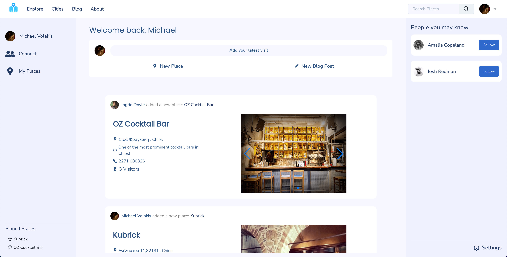
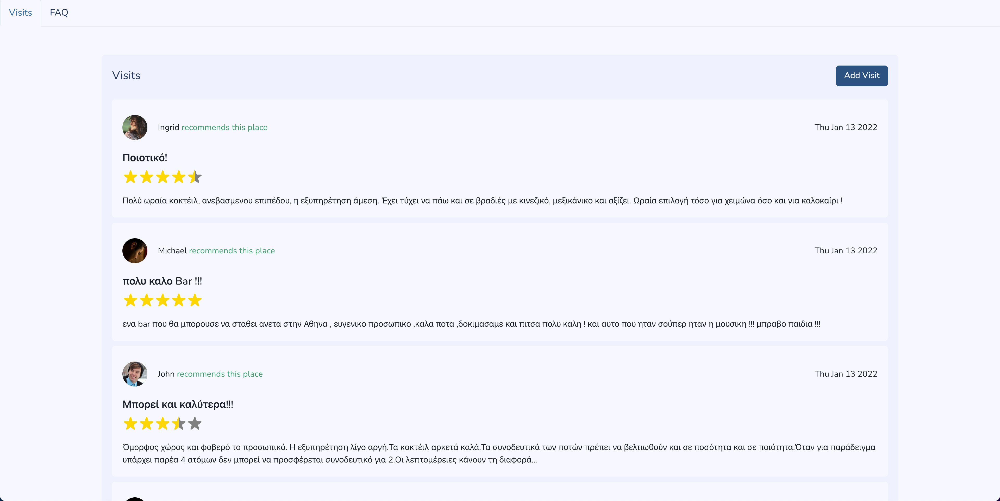
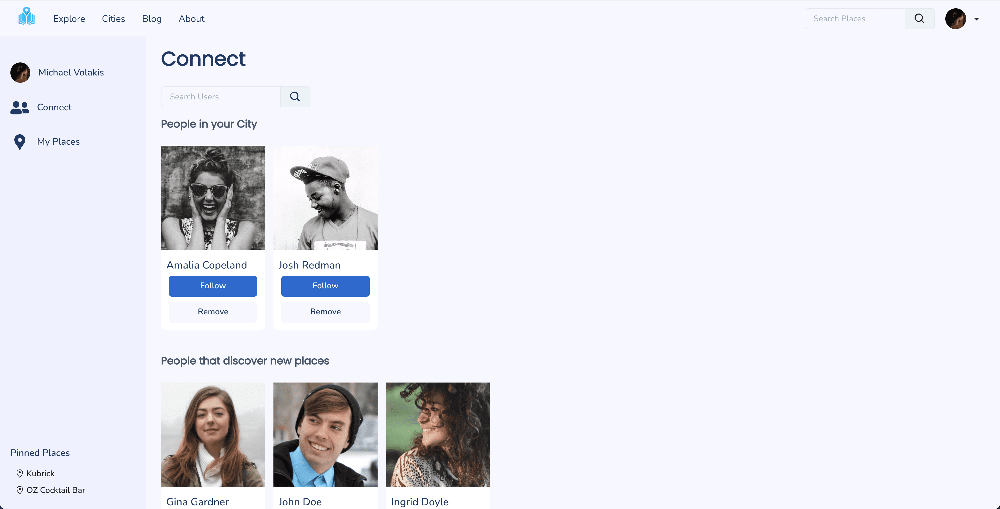

 

  
 

 
#  Atlacity

    
    
    
    
    
    

### ✏️ Overview

A Foursquare inspired web platform to explore new places in various cities around the world, rate shops, and connect with other people with same experiences⭐️.

### 🎯 Main Objectives

1. Create new places in a selected city
2. Explore places that other users have created
3. Create visits in a selected place :
    1. Post a rating
    2. Upload images of the place
    3. Describe the experience
4. Connect with other people based on user's visits:
    1. Allow comments for other user's visits
5. Create group chats for users visiting a specific place
6. Create Questions Section about a selected place
7. Recommend other places based on visited ones
